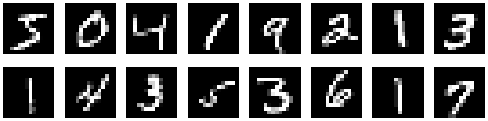
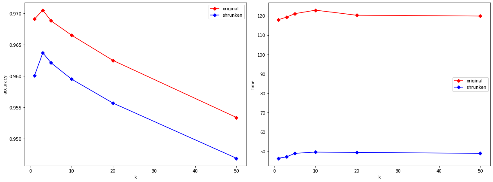
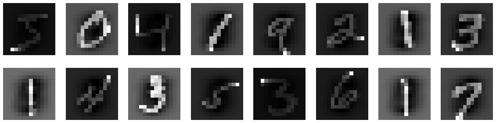
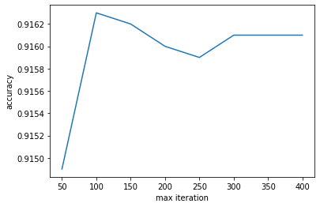

# Digit-Recognition
With data from MNIST dataset, I built classification models with accuracy over 96% using KNN, logistic regression, SVM, and created an interactive interface where you can draw a single digit which will be later recognized by these models using pygame. Demo:


## Dataset
Dataset comes from the MNIST database. The creator of this database tested many models and you can refer to [this paper](http://yann.lecun.com/exdb/mnist/) for more information. It can be loaded using tensorflow.

```python
import tensorflow as tf
(X_train, y_train), (X_test, y_test) = tf.keras.datasets.mnist.load_data()
```

There are 60000 training data and 10000 testing data, each data point is a 28 by 28 matrix whose entries (integers ranging from 0 to 255) represents the color of pixels in grayscale in the corresponding 28 by 28 digit image. Demo:


## The <sub>shrunken</sub> trick
When I was just mess with different models, sometimes the tuning process with cross validation took an extremely long time. I know the more training data there are, the better it is for the model, but can I do something to reduce the training time without undermining accuracy too much? Here is a trick I used in my freshman year, it's simple but helped me obtain a full mark in a CS assignment. 

The idea to shrink the size of each training digit matrix by removing every other row and column, in other words, keeping only the odd rows and columns. The size of the matrix becomes a quarter of the orignal, but the major characteristics of the digits are still recognizable, it just gets slightly blurred. Demo:



A lower accuracy is anticipated, but if the reduction in running time only compromises accuracy in an acceptable level, we may consider using __shrunken__ version of data to save us some time. This is the comparison between using the original data and the shrunken data on KNN:



The accuracy decreased by about 1% but the running time more than halved, I decide to use the __shrunken__ data afterwards. But of course, if you don't care about how long the training process takes or you have a better hardware, it's better to use the original data as it contains more information.

Moreover, for a faster convergence in logistic regression and svm, we may want to standardize the data, this is the effect of standardization on __Shrunken__ dataset:



## Model List
- [KNN](#knn)
- [Logistic Regression](#logistic-regression)
- [SVM](#svm)

### KNN
K-nearest neighbors, aka KNN, is an intuitive model whose logic is that close data points (measured by distance) tend to have the same label. This non-parametric model simply predicts the label of a new data point to be the most common one from the nearest K data. It's easy to understand and implement. KNN is sensitive to outliers because distance is the only measurement, thus it's important to find the optimal number of K (number of neighbors) to adjust the flexibility in the bias-variance tradeoff. 

K-nearest neighbors, aka KNN, is an intuitive model whose logic is that close data points tend to have the same label. It's sensitive to outliers, thus it's important to find the right K to make sure the model is both flexible enough and able to rule out the noise from outliers. I don't think it's necessary to standardize the data with KNN because all features (color of pixels) are homogeneous, no one will have dominant influence.

I tried to build KNN myself:

steps:

1. for each test data, calculate its (Euclidean) distance from all train data
2. sort the distances
3. find the nearest k train data 
4. predict test data based on the most common label among the k train data

It worked fine but it's extremely slow when dealing with such a large dataset, let alone doing cross validation and parameter tuning. There's still room to optimize sorting algorithm and memory usage (or data strucutre for storing previous data?), but that's not the focus of this project. Next, all will be done with scikit-learn package.

### Logistic Regression

To use Logistic Regression with scikit-learn package is simple. The common procedure is:

steps:

1. import the model from sklearn
2. create an instance with proper parameters
3. fit the model with train data
4. predict on test data

The problems here are which solver to use, how to make gradient descent to converge, what regularization to choose, etc.. Parameter tuning can be eaily achieved with the help of LogisticRegressionCV. 

If you're interested, you can refer to the [sci-kit learn documentation](https://scikit-learn.org/stable/modules/generated/sklearn.linear_model.LogisticRegression.html) to know more about difference between solvers, or take a look at an intuitive explanation first from this [blog](https://medium.com/distributed-computing-with-ray/how-to-speed-up-scikit-learn-model-training-aaf17e2d1e1).

Finding the optimal using the most rigourous approach in every step is time-costly, we can sometimes take sub-optimal path and it won't hurt too much, but the save on time is significant. For instance, convergence is always a big problem, but from the following graph we see even though logistic regression doesn't converge until over 350 iterations, its performance is already the best in 100 iterations. So maybe we don't need a complete gradient descent if we care more about running time.



### SVM

There are more parameters to fine-tune, like the value of C and gamma, which kernel to use, etc.. We can use GridSearchCV to facilitate the search process. Note that the correct way to standardize the data with cross validation is to standardize test fold and train fold separately, otherwise test fold will contain information from the train fold, so you shouldn't standardize the whole training set directly and use cross validation. This can be done using pipeline.

```python
steps = [('scaler', StandardScaler()), ('svm', SVC(kernel='rbf'))]
pipeline = Pipeline(steps)
parameters = {'svm__C':[0.1,1,10], 'svm__gamma':[0.01, 0.1,1,10]}
svm_gscv = GridSearchCV(pipeline, param_grid=parameters, cv=5)
svm_gscv.fit(X_train, y_train)
svm_gscv.best_params_
```

## Some little things

### Confusion matrix

Here are the confusion matrices for all three models. 


A rough look tells us that all models perform relatively bad on digit 9 (maybe it's easy to mistake it as 0 if the top half is too large and 7 is the circle is not drawn properly). Each model has its own strength in predicting certain numbers.

### Which digits are predicted wrongly?

I'm actually more interested in the wrong prediction than the accuracy. I wonder whether the algorithm is problematic to certain samples or it's simply due to awful writing. 

Here are some wrong predictions with standardization:


It's understandable to misclassify some images, I don't know what the third is and I'd say the fourth is 1 as well. However, I don't think such examples are useless or even harmful to the model, because we all know that awful writing will happen in real life. What use does it have to own a model only predicts pretty digits well? It won't be applicable in real life. We should be focusing on improving the model.

## Conclusion

It turns out the laziest KNN model has the highest test accuracy, but it doesn't mean much because it's not a fair play after all. In order to make the training process faster, we only used the __Shrunken__ data, the performance of other two models may increase after using all the data we have. Besides, I believe there are better ways to shrink the data than simply striping them, like using SVD (Singluar Value Decomposition), but let's save it for another day. 

The performances of all three models are not desirable, sometimes the most clear writing will be mistaken. Where the digit is written, how large it is, in what style it is, these are all factors to which the models are sensitive. It shows these models haven't captured all the patterns from the data, or the tuning process is far from complete. 

Nevertheless, this is a start. Other machine learning projects aren't too different from this one, the core is to find patterns within the data.
