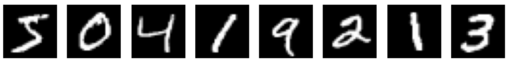
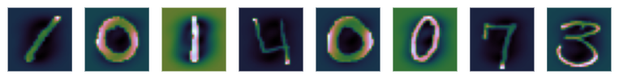

# Digit-Recognition
With data from MNIST, I'd like to build different classification models and compare their performances. The criterion here is accuracy, the percentage of correct predictions.

## Dataset
give some credits to the source and show visualization

The MNIST dataset contains XXX examples. Each example is a length 786 vector consisting of discrete values ranging from 0 to 255, each representing the color of a pixel in the corresponding 28 by 28 square image. By converting the vectors into the square matrices and mapping the numbers into colors (using color map __cubehelix__), we get the original look of the digits:

After standardization, the color of the images change:

## Model List
- [KNN](#knn)
- [Logistic Regression](#logistic-regression)
- [SVM](#svm)

## KNN
K-nearest neighbors, aka KNN, is an intuitive model. The logic behind is that data with similar features normally share the same label (for classification) or have close target values (for regression). Naive as it seems, it can actually perform pretty well in general settings. One of the sad things about this model is that we can't actually learn anything from it, but if we only care about accuracy, it might be a good choice. 

To begin with, I built KNN algorithm myself following the logic below:

steps:

1. for each test data, calculate its distance from all train data

2. sort the distances

3. find the nearest k train data 

4. predict test data based on the most common label among the k train data

The code I wrote worked fine but it was too slow when dealing with over 40k+ data. There is still room for data structure and sorting algorithm optimization. 

Next, I directly used the scikit-learn package. It contains built-in cross validation and grid search method for finding the optimal value of k, pretty convenient.

## Logistic Regression

## SVM

