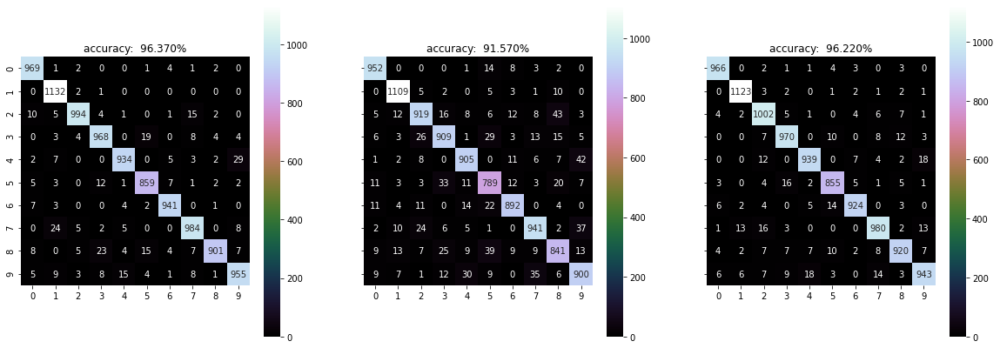

# Digit-Recognition
With data from MNIST dataset, I built classification models with accuracy over ... using KNN, logistic regression, SVM, and created an interactive interface where you can draw a single digit which will be later recognized by these models using pygame. Demo:


## Dataset
Dataset comes from the MNIST database. The creator of this database tested many models and you can refer to [this paper](http://yann.lecun.com/exdb/mnist/) for more information. It can be loaded using tensorflow.

```python
import tensorflow as tf
(X_train, y_train), (X_test, y_test) = tf.keras.datasets.mnist.load_data()
```

There are 60000 training data and 10000 testing data, each data point is a 28 by 28 matrix whose entries (integers ranging from 0 to 255) represents the color of pixels in grayscale in the corresponding 28 by 28 digit image. Demo:


## The <sub>shrunken</sub> trick
When I was just mess with different models, sometimes the tuning process with cross validation took an extremely long time. I know the more training data there are, the better it is for the model, but can I do something to reduce the training time without undermining accuracy too much? Here is a trick I used in my freshman year, it's simple but helped me obtain a full mark in a CS assignment. 

The idea to shrink the size of each training digit matrix by removing every other row and column, in other words, keeping only the odd rows and columns. The size of the matrix becomes a quarter of the orignal, but the major characteristics of the digits are still recognizable, it just gets slightly blurred. Demo:


A lower accuracy is anticipated, but if the reduction in running time only compromises accuracy in an acceptable level, we may consider using __shrunken__ version of data to save us some time. This is the comparison between using the original data and the shrunken data on KNN:


The accuracy decreased by about 1% but the running time more than halved, I decide to use the __shrunken__ data afterwards. But of course, if you don't care about how long the training process takes or you have a better hardware, it's better to use the original data as it contains more information.

## Model List
- [KNN](#knn)
- [Logistic Regression](#logistic-regression)
- [SVM](#svm)

### KNN
K-nearest neighbors, aka KNN, is an intuitive model whose logic is that close data points (measured by distance) tend to have the same label. This non-parametric model simply predicts the label of a new data point to be the most common one from the nearest K data. It's easy to understand and implement. KNN is sensitive to outliers because distance is the only measurement, thus it's important to find the optimal number of K (number of neighbors) to adjust the flexibility in the bias-variance tradeoff. 

K-nearest neighbors, aka KNN, is an intuitive model whose logic is that close data points tend to have the same label. It's sensitive to outliers, thus it's important to find the right K to make sure the model is both flexible enough and able to rule out the noise from outliers. I don't think it's necessary to standardize the data with KNN because all features (color of pixels) are homogeneous, no one will have dominant influence.

I tried to build KNN myself:

steps:

1. for each test data, calculate its (Euclidean) distance from all train data
2. sort the distances
3. find the nearest k train data 
4. predict test data based on the most common label among the k train data

It worked fine but it's extremely slow when dealing with such a large dataset, let alone doing cross validation and parameter tuning. There's still room to optimize sorting algorithm and memory usage (or data strucutre for storing previous data?), but that's not the focus of this project. Next, all will be done with scikit-learn package.

### Logistic Regression

To use Logistic Regression with scikit-learn package is simple. The common procedure is:

steps:

1. import the model from sklearn
2. create an instance with proper parameters
3. fit the model with train data
4. predict on test data

The problem here is which solver to use and how to make gradient descent to converge. Parameter tuning can be eaily achieved with the help of GridSearchCV.

```python

```

If you're interested, you can refer to the [sci-kit learn documentation](https://scikit-learn.org/stable/modules/generated/sklearn.linear_model.LogisticRegression.html) to know more about difference between solvers, or take a look at an intuitive explanation first from this [blog](https://medium.com/distributed-computing-with-ray/how-to-speed-up-scikit-learn-model-training-aaf17e2d1e1).

The confusion matrix:


Without standardization (this time even with max_iter = 1000, the gradient descent doesn't converge), the images are clearer.


Most misclassifications stay the same, but standardization does have an influence, not only on the speed of convergence of gradient descent, but also on performance on certain images. Some misclassification may look ridiculous, but the wrong predictions do actually capture partial patterns. For instance, the first image is predicted to be 0 while the true value is 5, if you take a closer look, the top half of the image does form 75% of 0, and the bottom half is small enough to be negligible. 

I believe such misclassifications are due to unconventional writings that mix patterns of other digits.

### SVM

There are more parameters to fine-tune, like the value of C and gamma, which kernel to use, etc.. We can use GridSearchCV to facilitate the search process. Note that if we wish to standardize the data, it's better to use pipeline to combine the scale process with the SVM building process. If we directly standardizae the whole dataset, later in the cross validation, the test fold will contain information from the train set, which is not desired. 

```python

```

## Questions you may ask

### Should I standardize or normalize the data?


After standardization, the color of the images change:


I'm actually more interested in the wrong prediction than the accuracy. I wonder whether the algorithm is problematic to certain samples or it's simply due to awful writing. 

Here are some of the wrong predictions with standardization:


It's understandable to misclassify some images, like the fourth one. I'd say it looks more like a "Y". After standardizaion, the color of some images are so deep that it's hard to tell the digits for human eyes, let's re-run the logistic regression without standardization and see whether the misclassification will stay the same.


## Conclusion

In terms of accuracy and speed, the performance of the three models is:


