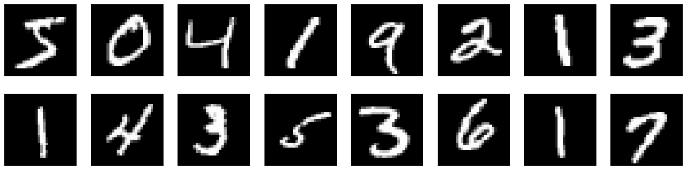

# Digit-Recognition
I tried three classification models on the MNIST dataset and created an interactive panel for the user to draw a digit, then used the best model to recognize it. This project itself is trivial , but in the process of actually implementing it, I realized that there are lots of details worth noticing.

## Dataset
Data comes from the MNIST database. The creator of this database tested many models and you can refer to [this paper](http://yann.lecun.com/exdb/mnist/) for more information.

There are 60000 training images and 10000 testing images, each image consists of 28*28 pixels and is stored as a one-dimensional vector whose entries correspond to the color of the pixels in greyscale. The entries range from 0 to 255, typical 8-bit images. Here are the first few images:

The dataset is relatively large, I find the training process extremly slow when doing cross validation and grid search to fine tune the hyperparameters. I have two solutions:

1. Simply take a subset of the whole dataset. Just make sure the subset maintains the original distribution of digits, i.e. the proportion of each digit doesn't change too much after taking the subset, otherwise we may lose information about certain digits (though unlikely, it's totally possible to have only 1% of the digits being 0 if we randomly subsetting)
2. This is the trick I used in my freshman year and it helped me obtain 100/100 in a CS assignment. The main idea is to reduce the size of each data while maintain as much information as possible. For each data in its 28*28 image form, we can remove every other row and column, you would still be able to recognize what digit it is, so does the machine. We halve the size of the data but the unique patterns of the digit that models learn are still there. 

After standardization, the color of the images change:

## Model List
- [KNN](#knn)
- [Logistic Regression](#logistic-regression)
- [SVM](#svm)

## KNN
K-nearest neighbors, aka KNN, is an intuitive model. The logic behind is that data with similar features normally share the same label (for classification) or have close target values (for regression). Naive as it seems, it can actually perform pretty well in general settings. One of the sad things about this model is that we can't actually learn anything from it, but if we only care about accuracy, it might be a good choice. 

To begin with, I built KNN algorithm myself following the logic below:

steps:

1. for each test data, calculate its distance from all train data
2. sort the distances
3. find the nearest k train data 
4. predict test data based on the most common label among the k train data

The code I wrote worked fine but it was too slow when dealing with over 40k+ data. There is still room for data structure and sorting algorithm optimization. 

Next, I directly used the scikit-learn package. It contains built-in cross validation and grid search method for finding the optimal value of k. I also examined the effects of standardizing the data on KNN, it turned out 

## Logistic Regression

To use Logistic Regression with scikit-learn package is simple. The common procedure is:

steps:

1. import the model from sklearn
2. create an instance with proper parameters
3. fit the model with train data
4. predict on test data

The problem here is which solver to use and convergence with gradient descent. The trade-off here is that the solver that converges faster tends to be expensive as it uses more data to calculate gradients. I decided to use the default solver 'lbfgs' allowed up to 1000 iterations for convergence.

If you're interested, you can refer to the [sci-kit learn documentation](https://scikit-learn.org/stable/modules/generated/sklearn.linear_model.LogisticRegression.html) to know more about difference between solvers, or take a look at an intuitive explanation first from this [blog](https://medium.com/distributed-computing-with-ray/how-to-speed-up-scikit-learn-model-training-aaf17e2d1e1).

The confusion matrix:

I'm actually more interested in the wrong prediction than the accuracy. I wonder whether the algorithm is problematic to certain samples or it's simply due to awful writing. 

Here are some of the wrong predictions with standardization:

It's understandable to misclassify some images, like the fourth one. I'd say it looks more like a "Y". After standardizaion, the color of some images are so deep that it's hard to tell the digits for human eyes, let's re-run the logistic regression without standardization and see whether the misclassification will stay the same.

Without standardization (this time even with max_iter = 1000, the gradient descent doesn't converge), the images are clearer.

Most misclassifications stay the same, but standardization does have an influence, not only on the speed of convergence of gradient descent, but also on performance on certain images. Some misclassification may look ridiculous, but the wrong predictions do actually capture partial patterns. For instance, the first image is predicted to be 0 while the true value is 5, if you take a closer look, the top half of the image does form 75% of 0, and the bottom half is small enough to be negligible. 

I believe such misclassifications are due to unconventional writings that mix patterns of other digits.

## SVM

There are more parameters to fine-tune, like the value of C and gamma, which kernel to use, etc.. We can use GridSearchCV to facilitate the search process. Note that if we wish to standardize the data, it's better to use pipeline to combine the scale process with the SVM building process. If we directly standardizae the whole dataset, later in the cross validation, the test fold will contain information from the train set, which is not desired. 

## Conclusion

In terms of accuracy and speed, the performance of the three models is:

